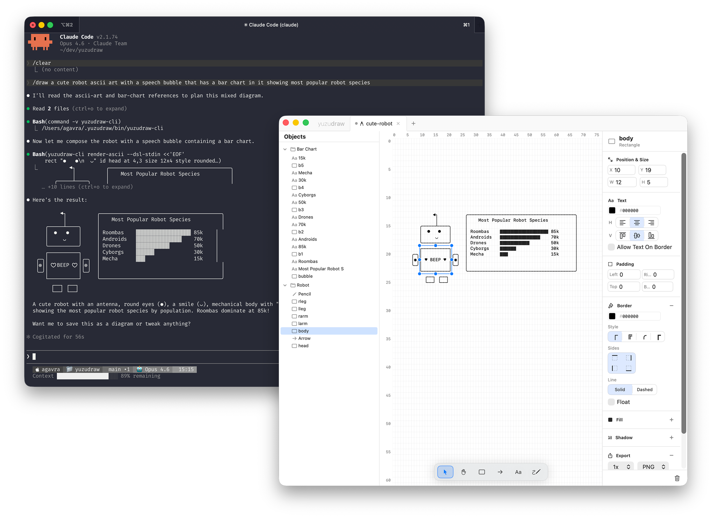

<p align="center">
  
</p>

<p align="center">
  <b>A macOS-native ASCII diagram editor with an agent skill.</b><br/>
  Let Codex or Claude generate your diagrams, then refine them on a visual canvas.<br/>
  <a href="https://www.yuzudraw.com">www.yuzudraw.com</a>
</p>

<p align="center">
  
  
  <a href="LICENSE"></a>
</p>

## Screenshot

<p align="center">
  
</p>

---

## Why YuzuDraw?

ASCII diagrams work well in docs, terminals, code comments, and agent workflows because they are lightweight, portable, and readable as plain text. YuzuDraw enables agents to generate ASCII diagrams and then for humans to modify and tweak them until they are perfect.

It ships with a CLI and a unified `/draw` skill, so you can prompt an agent to generate a diagram, open the result in YuzuDraw, and keep refining it visually.

## Download

Grab the latest `.dmg` from the [Releases](https://github.com/agavra/yuzudraw/releases) page — universal binary for Apple Silicon and Intel.

Or build from source (see [below](#building-from-source)).

## Quickstart

1. Download YuzuDraw from [Releases](https://github.com/agavra/yuzudraw/releases).
2. Install the CLI and draw skill:
   ```bash
   curl -fsSL https://www.yuzudraw.com/install.sh | sh
   ```
3. Prompt your agent:
   ```
   /draw a stacked bar chart of traffic mix by endpoint for search, checkout, and auth with read, write, and cache miss segments
   ```
4. Open the generated `.yuzudraw` file in the app and keep editing on the canvas.

The installer can add the `draw` skill for Codex and/or Claude and installs `yuzudraw-cli` locally.

## Features

### Prompt to canvas
- Generate diagrams through the `draw` skill and `yuzudraw-cli`
- Refine AI-generated output on a native visual canvas
- Export as plain ASCII text, PNG, or SVG
- Copy diagrams directly to the clipboard

### Drawing and editing
- Rectangles with configurable borders, fill patterns, dashed lines, and shadows
- Arrows with orthogonal routing, attachments, bend control, and multiple head styles
- Text labels and freeform pencil drawing
- Inline editing, inspector controls, undo/redo, and multi-tab workspace

### Organization
- Layers with visibility, lock toggles, and drag-and-drop reordering
- Grouping for related shapes and hierarchical structure
- Auto-save and file-based projects stored as `.yuzudraw`

## CLI and Skill

YuzuDraw includes a CLI (`yuzudraw-cli`) for agent workflows and a unified `/draw` skill for architecture diagrams, component diagrams, flow charts, bar charts, and ASCII art.

Core commands:

```bash
yuzudraw-cli create-diagram --name <name> --dsl-stdin
yuzudraw-cli update-diagram --name <name> --dsl-stdin
yuzudraw-cli get-diagram --name <name> --format both
yuzudraw-cli list-diagrams
yuzudraw-cli render-ascii --dsl-stdin
```

See [skills/draw/SKILL.md](skills/draw/SKILL.md) for the current skill workflow and invocation rules.

## DSL format

YuzuDraw diagrams can be described in a compact DSL used by the CLI and agent skill.
This format supports all builtin YuzuDraw functionality.

```text
layer "Diagram" visible
  rect "Agent" id agent at 2,2 size 14x3 style rounded
  rect "DSL" id dsl right-of agent gap 6 size 14x3
  rect "Canvas" id canvas right-of dsl gap 6 size 14x3 style double
  arrow from agent.right to dsl.left label "prompt"
  arrow from dsl.right to canvas.left label "open"
```

Example rendered output:

```text
  ╭────────────╮      ┌────────────┐      ╔════════════╗
  │   Agent    ├prompt▶    DSL     ├open──▶   Canvas   ║
  ╰────────────╯      └────────────┘      ╚════════════╝
```

See [YUZUDSL.md](YUZUDSL.md) for the current syntax reference.

## Building from source

**Requirements:** macOS 14+, Xcode 16+, [XcodeGen](https://github.com/yonaskolb/XcodeGen)

```bash
# Generate the Xcode project
xcodegen generate

# Build app
xcodebuild -scheme YuzuDraw -destination 'platform=macOS' build

# Build CLI
xcodebuild -project YuzuDraw.xcodeproj -scheme YuzuDrawCLI -configuration Debug build

# Run tests
xcodebuild -scheme YuzuDraw -destination 'platform=macOS' test
```

Or open `YuzuDraw.xcodeproj` in Xcode and hit Run.

## Architecture

MVVM with Swift 6 strict concurrency. The rendering pipeline:

```text
Document (shapes, layers) -> RenderEngine -> Canvas (2D char grid) -> SwiftUI Text
```

The canvas is a character buffer. Shapes remain the source of truth and the full grid is re-rendered on each mutation.

```text
YuzuDraw/
├── App/             # Entry point and menu commands
├── Models/          # Document, shapes, geometry, canvas grid
├── ViewModels/      # EditorViewModel, WorkspaceViewModel
├── Views/           # SwiftUI views (canvas, panels, toolbar)
├── Tools/           # Stateless drawing tools returning ToolActions
├── Serialization/   # JSON codable, DSL parser/serializer
├── Automation/      # Shared automation service used by CLI
└── Resources/       # Assets, entitlements, Info.plist
YuzuDrawCLI/
└── YuzuDrawCLI.swift # CLI entrypoint and command parsing
```

## Support YuzuDraw

YuzuDraw is free and open source. If you find it useful, please consider [sponsoring the project](https://github.com/sponsors/agavra),  it helps cover the Apple Developer license and keeps development going!

## License

[MIT](LICENSE)

Copyright &copy; 2026 Almog Gavra
